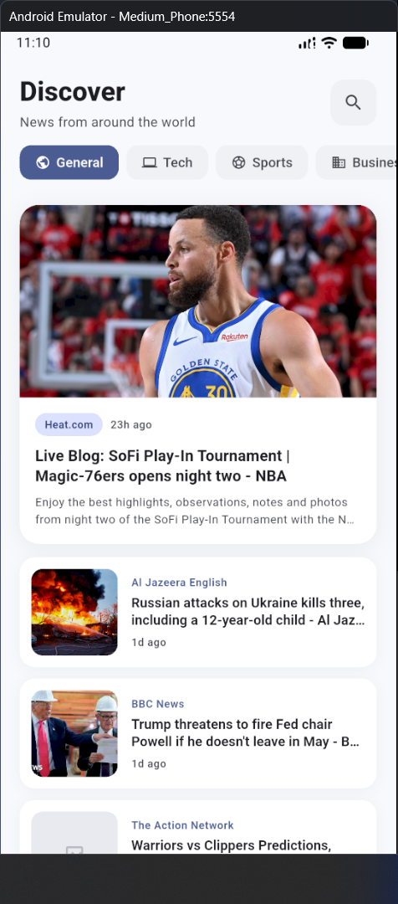
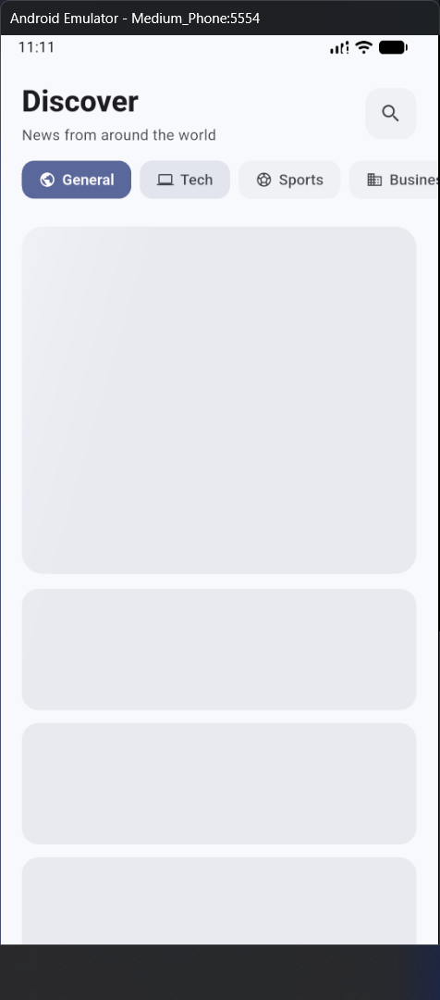
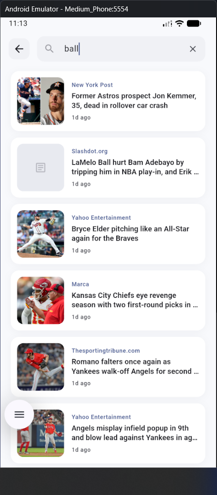
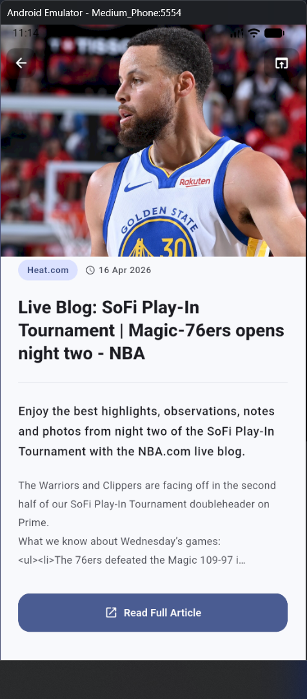
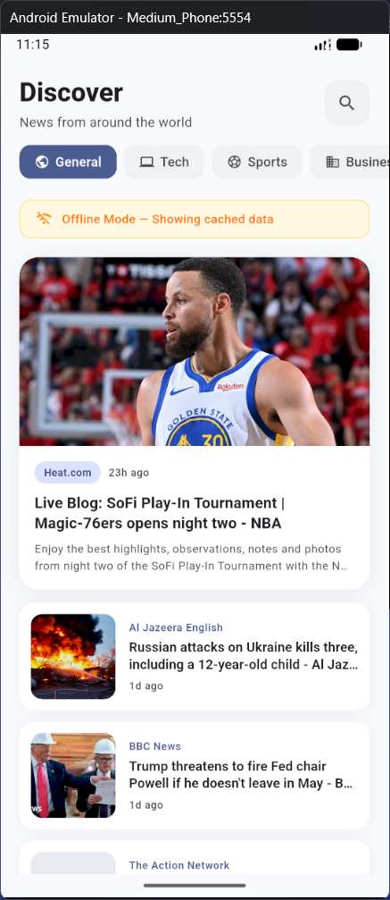
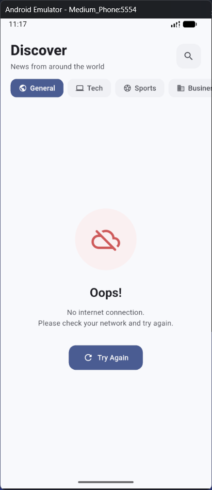

# Laporan UTS — NewsApp (Flutter)

**Nama:** [Nama Lengkap]  
**NIM:** 2331027  
**Mata Kuliah:** Lab Pengembangan Aplikasi Mobile  
**Semester:** 6 — 2025/2026

---

## 1. Fitur Aplikasi

### 1.1 Home Screen — Berita Terkini + Filter Kategori

Halaman utama menampilkan 7 berita terkini dari NewsAPI. Pengguna dapat memfilter berita berdasarkan kategori (General, Tech, Sports, Business, Health, Fun, Science) melalui horizontal chip selector.

<!-- 📸 SCREENSHOT 1: Home screen dengan daftar berita dan category chips di atas -->


### 1.2 Shimmer Loading Effect

Saat data sedang di-fetch dari API, aplikasi menampilkan shimmer animation yang menyerupai layout artikel asli, memberikan kesan loading yang smooth tanpa blank screen.

<!-- 📸 SCREENSHOT 2: Loading state dengan shimmer effect (buka app / pindah kategori, screenshot saat shimmer muncul) -->


### 1.3 Search — Pencarian Artikel

Pencarian menggunakan `async/await` dan `FutureBuilder` dengan debounce 500ms. UI tetap responsive dan tidak freeze saat memproses data.

<!-- 📸 SCREENSHOT 3: Search screen dengan hasil pencarian (ketik keyword, tunggu hasil muncul) -->


### 1.4 Detail Artikel

Menampilkan gambar hero, sumber, tanggal, author, dan konten artikel. Terdapat tombol "Read Full Article" untuk membuka artikel di browser.

<!-- 📸 SCREENSHOT 4: Detail screen sebuah artikel -->


### 1.5 Offline Mode + Error Handling

Saat tidak ada internet, aplikasi otomatis menampilkan data dari cache lokal dan menunjukkan banner "Offline Mode". Jika tidak ada cache, tampilan error yang ramah muncul dengan tombol retry.

<!-- 📸 SCREENSHOT 5: Offline mode (matikan WiFi emulator, refresh app) — banner kuning "Offline Mode" -->
<!-- 📸 SCREENSHOT 6: Error state (matikan WiFi + clear app data) — tampilan "Oops!" dengan tombol Try Again -->



---

## 2. Organisasi Kode

### Struktur Folder

```
lib/
├── models/         → Data model (Article)
├── services/       → API calls & caching logic
├── providers/      → State management (Provider)
├── views/          → Screens (Home, Search, Detail)
├── widgets/        → Reusable UI components
└── main.dart       → Entry point & theme config
```

### Mengapa Kode Ini Mudah Diperluas?

Arsitektur project mengikuti prinsip **Separation of Concerns** — setiap folder bertanggung jawab atas satu hal:

1. **API terpisah dari UI.** Seluruh komunikasi dengan NewsAPI ada di `services/news_service.dart`. Jika ingin mengganti API (misalnya ke Weather API), cukup ubah file ini tanpa menyentuh UI sama sekali.

2. **State management terisolasi.** `providers/news_provider.dart` menjadi jembatan antara service dan view. View tidak pernah memanggil API secara langsung — hanya membaca data dari provider.

3. **Widget reusable.** Komponen seperti `ArticleCard`, `LoadingShimmer`, dan `AppErrorWidget` dipakai di beberapa screen secara konsisten. Menambah screen baru tinggal menggunakan widget yang sudah ada.

4. **Menambah fitur baru tanpa merusak yang lama:**
   - Tambah screen baru? → Buat file di `views/`, gunakan widget dari `widgets/`.
   - Tambah API endpoint? → Buat method baru di `services/`, panggil dari `providers/`.
   - Tambah model data? → Buat file baru di `models/`.
   - Tidak perlu mengubah kode yang sudah ada.

### State Management — Provider

Provider dipilih karena alur datanya eksplisit (`Service → Provider → View`), direkomendasikan oleh tim Flutter untuk skala project ini, dan mudah di-debug tanpa boilerplate berlebih seperti BLoC.

---

**GitHub:** [https://github.com/LcckyBoyy/2331027-benebel-lab-mobile-2026](https://github.com/LcckyBoyy/2331027-benebel-lab-mobile-2026)
